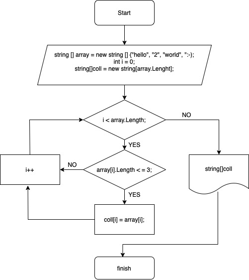

## Задача.
Написать программу, которая из имеющегося массива строк формирует массив из строк, длина которых меньше либо равна 3 символа. Первоначальный массив можно ввести с клавиатуры, либо задать на старте выполнения алгоритма. При решении не рекомендуется пользоваться коллекциями, лучше обойтись исключительно массивами.
## Текстовое описание решения.
1. Блок инициализации.
- Формируем массив строк "array" с конкретным указанием значения каждого элемента.
- Формируем массив строк "coll" с длинной, равной длинне первого массива.
- задаем значение индекса, равное "0".
2. Блок обработки данных - ветвление, следование, цикл.
- Проверяем значение длинны элемента массива "array" с индексом "0" - если оно меньше либо равно 3 присваиваем значению элемента массива "coll" текущее значение эдемента массива "array" и увеличиваем значчение индекса на 1.
Если нет - увеличиваем индекс на 1 и проверяем следующий элемент массива "array".
- Проверяем до тех пор, пока значение индекса меньше длинны массива "array".
3. Вывод полученных данных.
- Когда индекс выходит за границы длинны массива - выводим значения элементов массива "coll" со значениями элементов (строк) менее либо равно 3 символам.
## Алгоритм решения
